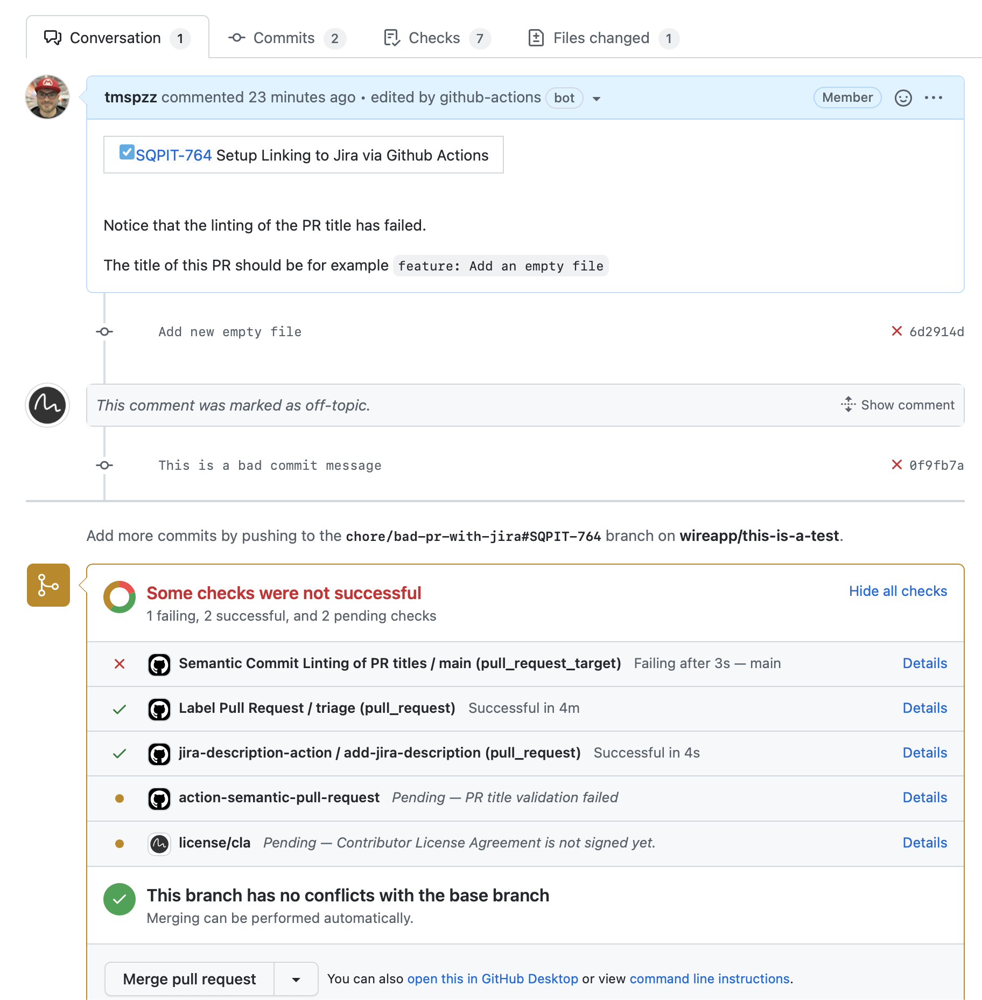

# .github
Github Organisation Workflows

## Generate Changelog Workflow

This workflow will automaticaly attach a changelog to a Github release whenever a new [Semantic Versioning](https://semver.org) tag starting with `v` is created in a repository.

### Usage 

The changelog is built from [Semantic Commit Messages](https://sparkbox.com/foundry/semantic_commit_messages).
Therefore, your commit messages have to be in this format:

```
type(category): description [flags]
```

Where type is one of the following:

- `breaking`
- `build`
- `ci`
- `chore`
- `docs`
- `feat`
- `fix`
- `other`
- `perf`
- `refactor`
- `revert`
- `style`
- `test`

Where flags is an optional comma-separated list of one or more of the following (must be surrounded in square brackets):

- `breaking`: alters `type` to be a breaking change

And category can be anything of your choice. If you use a type not found in the list (but it still follows the same format of the message), it'll be grouped under other.

E.g.:

`feat(messaging): Add support for sending images [breaking]`


### Set up

To add this action click on `Actions` in the top bar of the target repository, scroll to `Workflows created by Wire Swiss GmbH` and click `Set up this workflow`.

## Label Pull Request Workflow

This workflow will automaticaly add labels to a pull reques based on it's title. Therefore the title must follow [Semantic Commit Messages](https://sparkbox.com/foundry/semantic_commit_messages).

### Set up

#### Step 1

Add this action but clicking on `Actions` in the top bar of the target repository, scroll to `Workflows created by Wire Swiss GmbH` and click `Set up this workflow`.

### Step 2

In the `.github` folder in your repo, create a file called `labeler.yml` like the following:

```yml
# Types. This are lables such as `type: feature` 
'type: refactoring 🛠':
  title: '^refactor(\(.+\))?:.*'
'type: bug / fix 🐞':
  title: '^(run)?fix(\(.+\))?:.*'
'type: chore 🧹':
  title: '^chore(\(.+\))?:.*'
'type: documentation 📋':
  title: '^docs(\(.+\))?:.*'
'type: feature / request ✨':
  title: '^feat(\(.+\))?:.*'
'type: test 👷':
  title: '^test(\(.+\))?:.*'

# Sizes. Based on the amount of line changed
'👕 size: XS':
  size-below: 10
'👕 size: S':
  size-above: 9
  size-below: 100
'👕 size: M':
  size-above: 99
  size-below: 300
'👕 size: L':
  size-above: 299
  size-below: 500
'👕 size: XL':
  size-above: 499
  size-below: 1000
'👕 size: XXL':
  size-above: 999

# Components. Depens on the files that are changed.
'comp: FooBar':
  files:
    - 'bin/foobar/.*'
'comp: Readme':
  files:
   - 'README.md'
```

### Step 3

Add Otto-the-bot as "triage" to the target repository, make sure someone in the Web Chapter accepts the request.
Otto's github token, shared as organization secret, also needs to be made available to the target repo.

## Lint and Link PRs to JIRA

Use the reusable workflow in this repo instead of the base action.

### Setup (Reusable Workflow)

Create a workflow in your repository that calls the reusable workflow from this repo:

```yml
name: Link and Lint PR with Jira Ticket Number

on:
  pull_request:
    types: [opened, edited, synchronize, reopened, ready_for_review]

jobs:
  link-jira:
    uses: wireapp/.github/.github/workflows/jira-link-pr-reusable.yml@main
    with:
      # Optional: override defaults below
      # jira-base-url: https://wearezeta.atlassian.net
      # version-name: ''            # omit or leave empty to skip compare
      # fix-version-regex: '(?:^|[\s\-_])(v?\d+\.\d+(?:\.\d+)?(?:[\-\+][\w\.\-]*)?)'
      # skip-branches: '^(production-release|main|master|release\/v\d+)$'
      # skip-actors: 'dependabot[bot],AndroidBob'
    secrets:
      GITHUB_TOKEN: ${{ secrets.GITHUB_TOKEN }}
      # Map your org/repo secret containing the Jira token
      JIRA_TOKEN: ${{ secrets.OTTO_THE_BOT_JIRA_TOKEN }}
```

Notes:
- `version-name` is optional. If omitted or empty, the workflow will not pass `compare-fix-version` to the underlying action.

### Example

See https://github.com/wireapp/this-is-a-test/pull/2




## Lint the title of a PR according to Semantic Commit messages

For a complete description see https://github.com/marketplace/actions/semantic-pull-request

### Setup

To add this action click on `Actions` in the top bar of the target repository, scroll to `Workflows created by Wire Swiss GmbH` and click `Set up this workflow`.


## Automatic cherry-pick from release candidate to TARGET_BRANCH

This action automates the process of cherry-picking merged PRs from `release/candidate` branch to `TARGET_BRANCH`.
It is triggered whenever a pull request is merged into `release/candidate`.

The action performs the following steps:
1. Checkout the merged PR.
2. If changes are made outside the specified submodule or no submodule is specified, the action proceeds.
3. If a submodule name is provided in the `SUBMODULE_NAME` environment variable:
   a. The action creates a temporary branch.
   b. Updates the submodule to its latest version from `develop`.
   c. Commits the submodule updates.
4. Squashes the commit with the commit message of the merged PR (if a submodule was updated).
5. Cherry-picks the squashed (or original if no squashing occurred) commit to a new branch based on `develop`.
6. If any conflicts arise during the cherry-pick, they are committed.
7. The branch with the cherry-picked changes is pushed.
8. A new pull request is created against `develop` with the cherry-picked changes.

**Note**: Ensure you add a "cherry-pick" label to your project. This label is required for the creation of cherry-picked PRs.

If needed, you can also set the `TARGET_BRANCH` environment variable to specify a different target branch for the cherry-pick.
By default, it's set to `develop`.
